# Healthcare Management System (HCMS) - Comprehensive Platform

## 🎯 Project Overview

The Healthcare Management System (HCMS) is a comprehensive digital platform designed to modernize healthcare management for Aanganwadi centers across India. The system integrates multiple healthcare modules including child health tracking, vaccination management, telemedicine, AI-powered health insights, donation management, and administrative oversight to create a unified healthcare ecosystem.

## 🏗️ System Architecture

### High-Level Architecture
```
┌─────────────────┐    ┌─────────────────┐    ┌─────────────────┐
│   Frontend      │    │    Backend      │    │    Database     │
│   (React)       │◄──►│   (Node.js)     │◄──►│   (MongoDB)     │
│                 │    │                 │    │                 │
│ - Multi-role UI │    │ - REST APIs     │    │ - Collections   │
│ - Real-time     │    │ - Socket.io     │    │ - Change Stream │
│ - AI Features   │    │ - AI Integration│    │ - Relationships │
│ - Telemedicine  │    │ - File Upload   │    │ - Aggregations  │
└─────────────────┘    └─────────────────┘    └─────────────────┘
```

### Technology Stack
- **Frontend**: React.js, Tailwind CSS, Socket.io Client, WebRTC
- **Backend**: Node.js, Express.js, Socket.io, Mongoose ODM
- **Database**: MongoDB with Change Streams
- **AI Integration**: External AI APIs for health insights
- **File Storage**: Cloudinary for images/documents
- **Real-time**: Socket.io for live notifications and video calls
- **Authentication**: JWT-based role-based access control

## 📊 System Diagrams & Visualizations

### 🎭 Use Case Diagram

```mermaid
graph TB
    %% Actors
    PU[Public User]
    AS[Aanganwadi Staff]
    CO[Coordinator]
    DR[Doctor]
    AD[Administrator]
    
    %% System Boundary
    subgraph HCMS["Healthcare Management System (HCMS)"]
        %% Public Use Cases
        D1[Make Donations]
        D2[Donate Money]
        D3[Donate Items]
        
        %% Staff Use Cases
        CM1[Manage Child Profiles]
        CM2[Record Health Data]
        CM3[Track Vaccinations]
        CM4[Generate Health Reports]
        CM5[Access AI Insights]
        CM6[Communicate with Doctors]
        
        %% Coordinator Use Cases
        RM1[Monitor Inventory]
        RM2[Create Resource Appeals]
        RM3[Track Appeal Status]
        RM4[Manage Multiple Centers]
        RM5[Generate Reports]
        
        %% Doctor Use Cases
        TM1[Conduct Video Consultations]
        TM2[Review Health Records]
        TM3[Generate Prescriptions]
        TM4[Schedule Appointments]
        TM5[Access AI Diagnostics]
        TM6[Issue Medical Certificates]
        
        %% Admin Use Cases
        AM1[Manage User Accounts]
        AM2[Approve Appeals]
        AM3[Monitor System Analytics]
        AM4[Configure System Settings]
        AM5[Access All Data]
        AM6[Generate System Reports]
        
        %% AI Use Cases
        AI1[Health Query Assistance]
        AI2[Diagnostic Predictions]
        AI3[Vaccination Guidance]
        AI4[Prescription Support]
        AI5[Medical Certificate Generation]
    end
    
    %% Connections
    PU --> D1
    PU --> D2
    PU --> D3
    
    AS --> CM1
    AS --> CM2
    AS --> CM3
    AS --> CM4
    AS --> CM5
    AS --> CM6
    AS --> AI1
    AS --> AI2
    AS --> AI3
    
    CO --> RM1
    CO --> RM2
    CO --> RM3
    CO --> RM4
    CO --> RM5
    CO --> AI1
    
    DR --> TM1
    DR --> TM2
    DR --> TM3
    DR --> TM4
    DR --> TM5
    DR --> TM6
    DR --> AI2
    DR --> AI4
    DR --> AI5
    
    AD --> AM1
    AD --> AM2
    AD --> AM3
    AD --> AM4
    AD --> AM5
    AD --> AM6
    
    %% Include relationships
    CM2 -.->|includes| CM1
    CM3 -.->|includes| CM1
    TM2 -.->|includes| CM2
    TM3 -.->|includes| TM2
    RM2 -.->|includes| RM1
    AM2 -.->|includes| RM2
```

### 🏛️ System Architecture Diagram

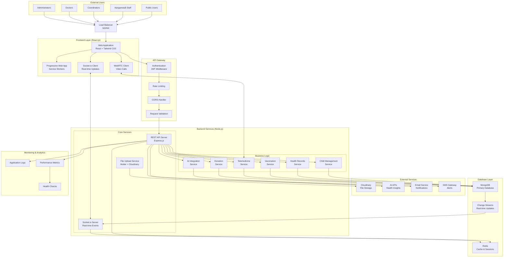

### 🗄️ Database Schema Diagram

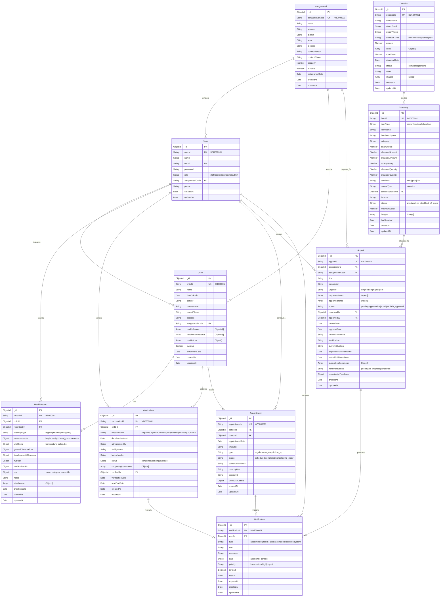

### 🔄 System Workflow Diagrams

#### Child Health Management Workflow
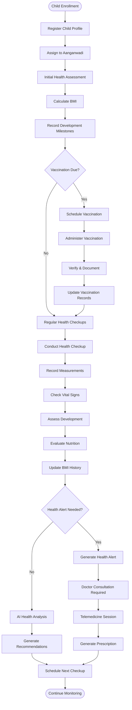

#### Telemedicine Consultation Workflow
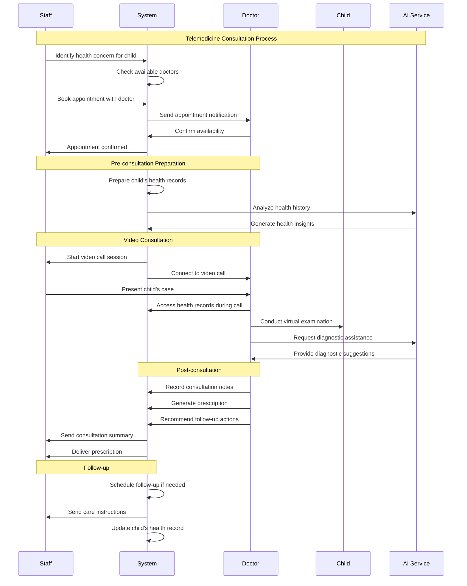

#### Donation to Distribution Workflow
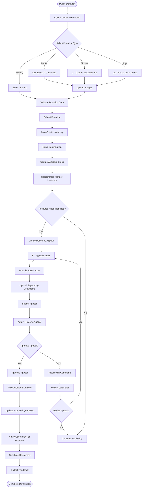

#### AI-Powered Health Assistance Workflow
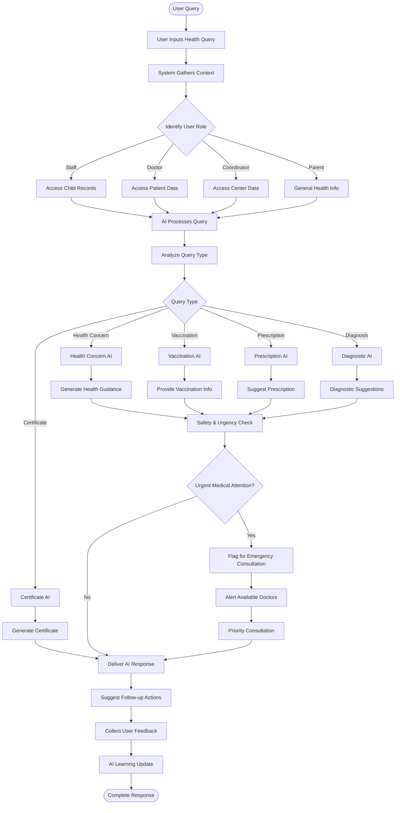

### 📱 Frontend Component Architecture

```mermaid
graph TB
    subgraph "App.jsx - Main Application"
        ROUTER[React Router]
        AUTH_CONTEXT[User Context]
        ERROR_BOUNDARY[Error Boundary]
    end
    
    subgraph "Public Pages"
        HOME[HomePage.jsx]
        DONATE[DonatePage.jsx]
        CONTACT[Contact.jsx]
    end
    
    subgraph "Authentication"
        LOGIN[Login Component]
        REGISTER[Register Component]
    end
    
    subgraph "Staff Dashboard"
        STAFF_DASH[StudentDashboard.jsx]
        CHILD_PROFILE[ChildProfile Components]
        HEALTH_FORM[HealthRecordForm.jsx]
        VAC_MGMT[Vaccination Management]
    end
    
    subgraph "Coordinator Dashboard"
        COORD_DASH[CoordinatorDashboard.jsx]
        INVENTORY[Inventory Tab]
        APPEALS[Appeals Tab]
        CREATE_APPEAL[Create Appeal Form]
    end
    
    subgraph "Doctor Portal"
        DOC_DASH[DoctorsDashboard.jsx]
        APPOINTMENT[Booking Components]
        VIDEO_CALL[VideoCall.jsx]
        TELEMEDICINE[Telemedicine.jsx]
    end
    
    subgraph "AI Features"
        AI_BOT[Aibot.jsx]
        AI_CHAT[AiBot Components]
        AI_FEATURES[AI Features Components]
        VOICE_ASSIST[Voice Assistant]
    end
    
    subgraph "Shared Components"
        NAVBAR[Navbar]
        HEADER[Header Components]
        MODAL[Modal Components]
        NOTIFICATION[Notification System]
    end
    
    subgraph "Real-time Services"
        SOCKET[Socket.io Client]
        WEBRTC[WebRTC Client]
        PUSH_NOTIF[Push Notifications]
    end
    
    %% Connections
    ROUTER --> HOME
    ROUTER --> DONATE
    ROUTER --> LOGIN
    ROUTER --> STAFF_DASH
    ROUTER --> COORD_DASH
    ROUTER --> DOC_DASH
    ROUTER --> AI_BOT
    
    AUTH_CONTEXT --> LOGIN
    AUTH_CONTEXT --> STAFF_DASH
    AUTH_CONTEXT --> COORD_DASH
    AUTH_CONTEXT --> DOC_DASH
    
    STAFF_DASH --> CHILD_PROFILE
    STAFF_DASH --> HEALTH_FORM
    STAFF_DASH --> VAC_MGMT
    
    COORD_DASH --> INVENTORY
    COORD_DASH --> APPEALS
    COORD_DASH --> CREATE_APPEAL
    
    DOC_DASH --> APPOINTMENT
    DOC_DASH --> VIDEO_CALL
    DOC_DASH --> TELEMEDICINE
    
    AI_BOT --> AI_CHAT
    AI_BOT --> AI_FEATURES
    AI_BOT --> VOICE_ASSIST
    
    VIDEO_CALL --> WEBRTC
    TELEMEDICINE --> WEBRTC
    NOTIFICATION --> SOCKET
    NOTIFICATION --> PUSH_NOTIF
```

### 🔄 Detailed Sequence Diagrams

#### Child Registration & Health Assessment Sequence
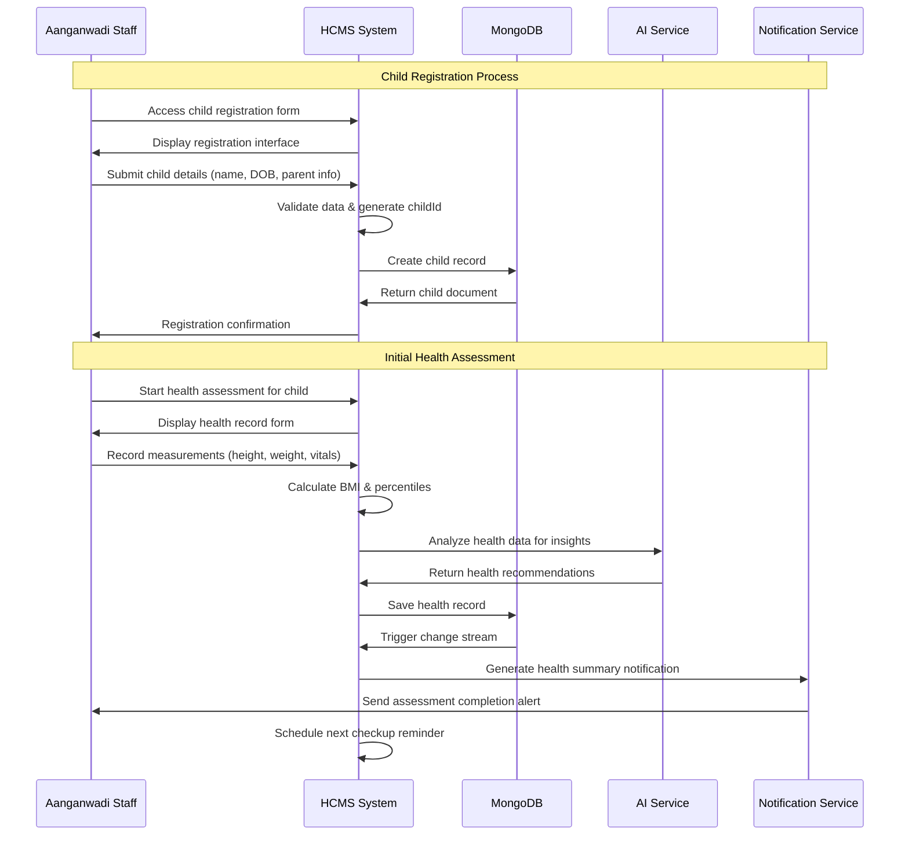

#### Vaccination Management Sequence
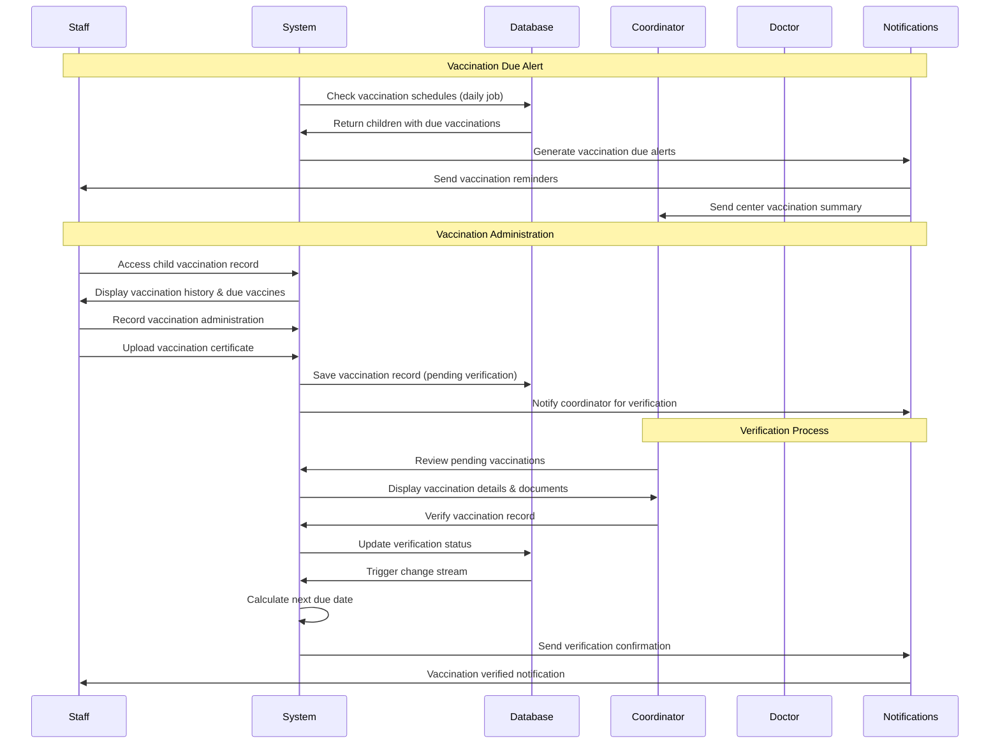

#### Telemedicine Appointment Sequence
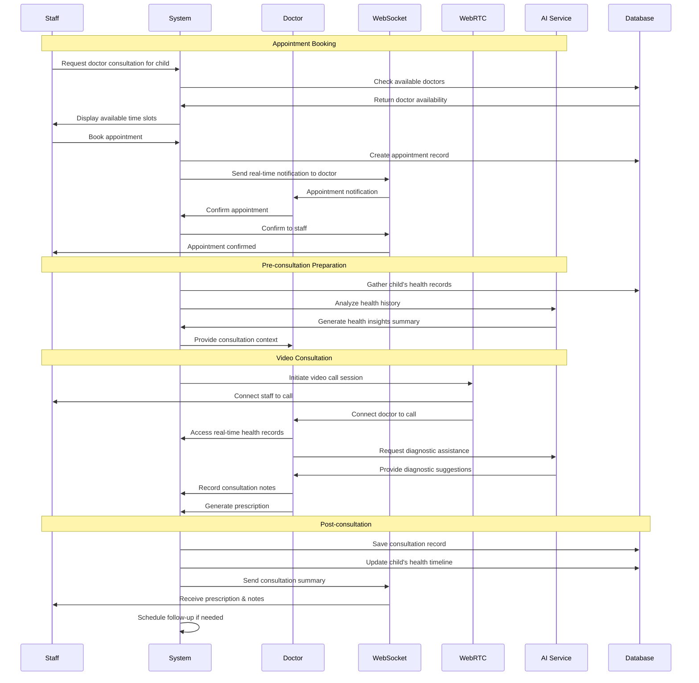

#### Resource Appeal & Auto-allocation Sequence
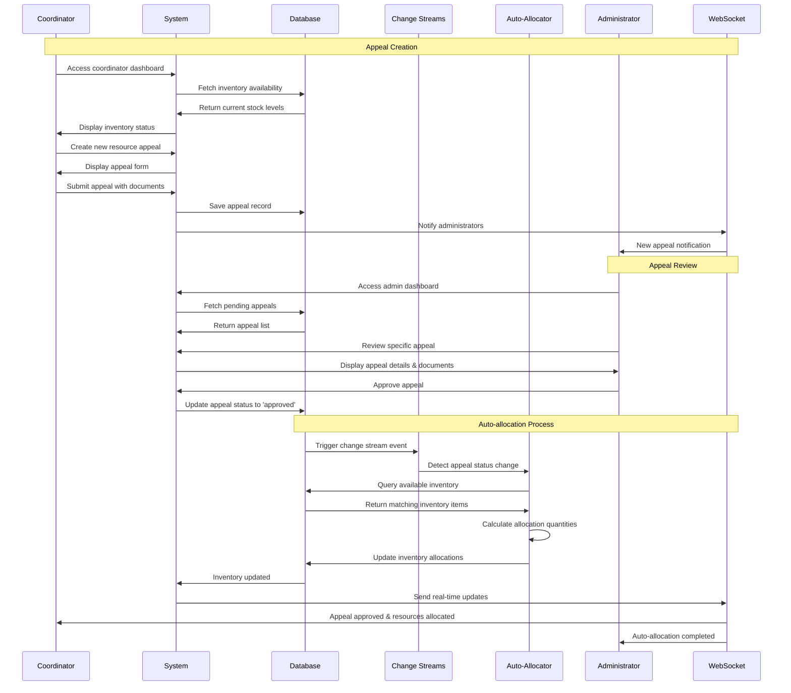

#### AI Health Assistance Sequence
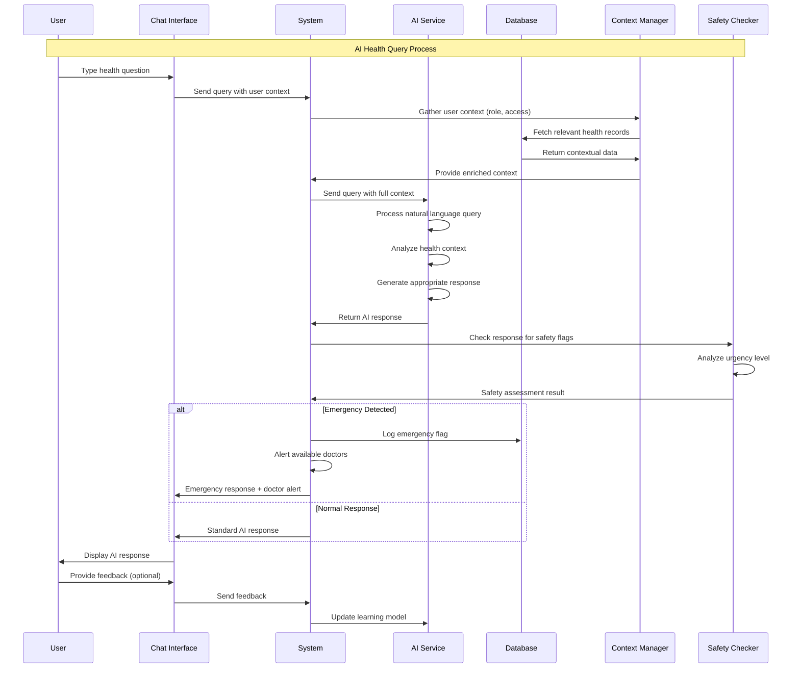

### 🎯 System Integration Diagram

```mermaid
graph TB
    subgraph "External Integrations"
        GOV[Government Health APIs]
        BANK[Payment Gateways]
        EMAIL[Email Services]
        SMS[SMS Gateways]
        CLOUD_STORAGE[Cloudinary Storage]
        AI_PROVIDERS[AI Service Providers]
    end
    
    subgraph "HCMS Core System"
        subgraph "Frontend Layer"
            WEB_APP[Web Application]
            MOBILE_APP[Mobile App - Future]
            PWA[Progressive Web App]
        end
        
        subgraph "API Gateway"
            AUTH_GATE[Authentication Gateway]
            RATE_LIMIT[Rate Limiting]
            API_VERSIONING[API Versioning]
        end
        
        subgraph "Microservices Architecture"
            USER_SVC[User Management Service]
            CHILD_SVC[Child Management Service]
            HEALTH_SVC[Health Records Service]
            VAC_SVC[Vaccination Service]
            TELE_SVC[Telemedicine Service]
            DON_SVC[Donation Service]
            AI_SVC[AI Integration Service]
            NOTIF_SVC[Notification Service]
        end
        
        subgraph "Data Layer"
            MONGO_PRIMARY[MongoDB Primary]
            MONGO_SECONDARY[MongoDB Secondary]
            REDIS_CACHE[Redis Cache]
            FILE_STORAGE[File Storage]
        end
        
        subgraph "Infrastructure"
            LOAD_BALANCER[Load Balancer]
            MONITORING[Monitoring & Logs]
            BACKUP[Backup System]
            SECURITY[Security Layer]
        end
    end
    
    subgraph "External Systems"
        HOSPITAL_SYS[Hospital Management Systems]
        LAB_SYS[Laboratory Systems]
        PHARMACY[Pharmacy Systems]
        INSURANCE[Insurance Providers]
    end
    
    %% External Integrations
    AI_SVC <--> AI_PROVIDERS
    DON_SVC <--> BANK
    NOTIF_SVC <--> EMAIL
    NOTIF_SVC <--> SMS
    HEALTH_SVC <--> CLOUD_STORAGE
    VAC_SVC <--> GOV
    
    %% Frontend to Gateway
    WEB_APP --> AUTH_GATE
    MOBILE_APP --> AUTH_GATE
    PWA --> AUTH_GATE
    
    %% Gateway to Services
    AUTH_GATE --> USER_SVC
    AUTH_GATE --> CHILD_SVC
    AUTH_GATE --> HEALTH_SVC
    AUTH_GATE --> VAC_SVC
    AUTH_GATE --> TELE_SVC
    AUTH_GATE --> DON_SVC
    AUTH_GATE --> AI_SVC
    AUTH_GATE --> NOTIF_SVC
    
    %% Services to Data
    USER_SVC --> MONGO_PRIMARY
    CHILD_SVC --> MONGO_PRIMARY
    HEALTH_SVC --> MONGO_PRIMARY
    VAC_SVC --> MONGO_PRIMARY
    TELE_SVC --> MONGO_PRIMARY
    DON_SVC --> MONGO_PRIMARY
    
    %% Data Replication
    MONGO_PRIMARY --> MONGO_SECONDARY
    MONGO_PRIMARY --> REDIS_CACHE
    
    %% Infrastructure
    LOAD_BALANCER --> AUTH_GATE
    MONITORING --> USER_SVC
    MONITORING --> CHILD_SVC
    MONITORING --> HEALTH_SVC
    BACKUP --> MONGO_PRIMARY
    SECURITY --> AUTH_GATE
    
    %% External System Integration
    HEALTH_SVC <--> HOSPITAL_SYS
    VAC_SVC <--> LAB_SYS
    TELE_SVC <--> PHARMACY
    USER_SVC <--> INSURANCE
```

    
## �️ Visual System Documentation

All system diagrams are available in the `/diagrams` directory. To generate high-quality images from the Mermaid diagram files:

### Quick Start - Generate All Diagrams
```bash
cd diagrams
npm install
npm run generate
```

### Available Diagrams
- **Use Case Diagram**: Complete actor-system interactions
- **System Architecture**: High-level component relationships  
- **Database Schema**: Entity-relationship diagrams
- **Workflow Diagrams**: Process flows for key features
- **Sequence Diagrams**: Step-by-step system interactions

### Generated Output Formats
- **PNG**: High-resolution images (1920x1080)
- **SVG**: Vector graphics for web/print
- **Viewable in**: Documentation, presentations, reports

For detailed instructions, see `/diagrams/README.md`### 1. Public Users (Anonymous)
- **Access**: Donation portal
- **Capabilities**: 
  - Make monetary donations
  - Donate physical items (books, clothes, toys)
  - View donation confirmation

### 2. Aanganwadi Staff
- **Access**: Staff dashboard, child management
- **Capabilities**:
  - Manage child profiles and enrollment
  - Record health checkups and measurements
  - Track vaccination schedules
  - Generate health reports
  - Access AI health insights
  - Communication with doctors

### 3. Coordinators
- **Access**: Coordinator dashboard, resource management
- **Capabilities**:
  - Monitor inventory across Aanganwadis
  - Create resource appeals for supplies
  - Oversee multiple Aanganwadi centers
  - Track vaccination compliance
  - Generate administrative reports

### 4. Volunteer Doctors
- **Access**: Doctor dashboard, telemedicine platform
- **Capabilities**:
  - Conduct virtual consultations
  - Review child health records
  - Provide medical prescriptions
  - Schedule appointments
  - Access AI diagnostic tools
  - Generate medical certificates

### 5. System Administrators
- **Access**: Admin dashboard, full system control
- **Capabilities**:
  
  - Approve resource appeals
 
 

## 📊 Core System Modules

### 1. Child Health Management
**Purpose**: Comprehensive tracking of child health and development

**Key Features**:
- **Child Registration**: Complete demographic and guardian information
- **Health Record Tracking**: Regular and detailed health checkups
- **BMI Monitoring**: Automated BMI calculation and tracking over time
- **Development Milestones**: Motor, language, social, and cognitive skills tracking
- **Nutrition Assessment**: Feeding patterns and nutritional status monitoring
- **Medical History**: Integration with external doctor visits and treatments

**Database Schema**:
```javascript
Child {
  childId: String (unique),
  name: String,
  dateOfBirth: Date,
  gender: String,
  parentInfo: Object,
  aanganwadiCode: String,
  healthRecords: [ObjectId],
  vaccinationRecords: [ObjectId],
  bmiHistory: [Object],
  isActive: Boolean
}
```

### 2. Vaccination Management System
**Purpose**: Ensure compliance with mandatory vaccination schedules

**Key Features**:
- **Mandatory Vaccination Tracking**: 6 core vaccines monitoring
- **Schedule Management**: Automated due date calculations
- **Document Upload**: Vaccination certificates and proof
- **Compliance Reporting**: Center-wide vaccination statistics
- **Reminder System**: Automated notifications for due vaccinations
- **Verification Workflow**: Multi-level verification by coordinators

**Tracked Vaccinations**:
1. Hepatitis B
2. MMR (Measles, Mumps, Rubella)
3. Varicella (Chickenpox)
4. Tdap (Tetanus, Diphtheria, Pertussis)
5. Meningococcal ACWY
6. COVID-19


### 4. AI-Powered Health Insights
**Purpose**: Leverage AI for improved health decision-making

**AI Modules**:
- **Health Concern Chat**: AI assistant for general health queries
- **Diagnostic Predictions**: AI-powered preliminary diagnosis suggestions
- **Vaccination Concerns**: AI guidance on vaccination-related questions
- **Prescription Generation**: AI-assisted prescription recommendations
- **Doctor Insights**: AI analytics for doctors during consultations
- **Medical Certificate Generation**: Automated certificate creation

**Integration Points**:
- Real-time chat interfaces with AI
- Integration with health records for context
- Multi-language AI responses
- Continuous learning from user interactions

### 5. Donation & Resource Management
**Purpose**: Facilitate community donations and efficient resource distribution

**Donation Types**:
- **Monetary Donations**: Direct financial contributions
- **Educational Materials**: Books and learning resources
- **Clothing Donations**: Children's clothing and accessories
- **Toy Donations**: Educational and recreational toys

**Resource Management**:
- **Automated Inventory**: Donations automatically create inventory entries
- **Real-time Tracking**: Available vs allocated resource monitoring
- **Appeal System**: Coordinators can request specific resources
- **Auto-allocation**: Approved appeals automatically allocate inventory
- **Transparency**: Full donation-to-distribution tracking

### 6. Notification & Communication System
**Purpose**: Real-time communication across the platform

**Notification Types**:

- **Health Alerts**: Critical health status notifications
- **Vaccination Reminders**: Due vaccination notifications
- **Resource Alerts**: Low inventory and appeal status updates


**Communication Channels**:
- **In-app Notifications**: Real-time browser notifications
- **Socket.io Integration**: Live updates across all users


## 🔄 System Workflows

### 1. Child Enrollment & Health Tracking
```
Coordinator Registration → Staff Registration → Child Profile Creation → Initial Health Assessment → 
Regular Checkups → BMI Tracking → Development Monitoring → Health Alerts
```

### 2. Vaccination Management Workflow
```
Vaccination Due → Reminder Notification → Vaccination Administered → Status Update → Next Due Calculation
```


### 5. Donation to Distribution Workflow
```
Public Donation → Inventory Creation → Resource Appeal → Admin Approval → 
Auto-allocation → Real-time Updates 
```

## 📱 Frontend Architecture

### Page Structure
```
src/
├── Pages/
│   ├── HomePage.jsx                 # Public landing page
│   ├── DonatePage.jsx              # Public donation portal
│   ├── VaccinationManagement.jsx   # Vaccination tracking
│   ├── CoordinatorDashboard.jsx    # Resource management
│   ├── DoctorsDashboard.jsx        # Doctor interface
│   ├── PatientForm.jsx             # Child registration
│   ├── Certificate.jsx             # certificates
│   ├── Aibot.jsx                   # AI assistant
│   ├── Contact.jsx                 # Contact information
│   └── Noti.jsx                    # Notifications center
│
├── components/
│   ├── ChildProfile/               # Child management
│   ├── DoctorDashboard/            # Doctor interface
│   ├── Healthrecordform/           # Health tracking
│   ├── Login/                      # Authentication
│   ├── StudentDashboard/           # Staff dashboard
│   ├── Vaccination/                # Vaccination management

```

### Component Features
- **Responsive Design**: Mobile-first approach with Tailwind CSS
- **Real-time Updates**: Socket.io integration for live data
- **Multi-language Support**: Regional language interfaces
- **Accessibility**: Screen reader and keyboard navigation support
- **Progressive Web App**: Offline capabilities and app-like experience

## 🖥️ Backend Architecture

### API Structure
```
/api/v1/
├── auth/                    # Authentication & authorization
├── children/                # Child management
├── health-records/          # Health data management
├── vaccinations/           # Vaccination tracking
├── doctors/               # Doctor management
├── aanganwadis/           # Center management
├── donations/             # Donation processing
├── inventory/             # Resource management
├── appeals/               # Resource requests
├── notifications/         # Communication system
└── ai/                    # AI service integration
```

### Database Collections

#### Children Collection
```javascript
{
  childId: "CH000001",
  name: "Child Name",
  dateOfBirth: Date,
  gender: "Male/Female",
  parentName: String,
  parentPhone: String,
  address: String,
  aanganwadiCode: String,
  healthRecords: [ObjectId],
  vaccinationRecords: [ObjectId],
  bmiHistory: [Object],
  isActive: Boolean
}
```

#### Health Records Collection
```javascript
{
  childId: ObjectId,
  recordedBy: ObjectId,
  checkupType: "regular/detailed",
  measurements: Object,
  vitalSigns: Object,
  generalObservations: Object,
  developmentMilestones: Object,
  nutrition: Object,
  medicalDetails: Object,
  bmi: Object,
  notes: String
}
```

#### Vaccination Records Collection
```javascript
{
  childId: ObjectId,
  vaccineName: String,
  dateAdministered: Date,
  administeredBy: String,
  facilityName: String,
  status: "completed/pending/overdue",
  supportingDocuments: [Object],
  verifiedBy: ObjectId
}
```


## 🚀 Key System Features

### 1. Real-time Communication
- **Socket.io Integration**: Live notifications and updates
- **WebRTC Video Calls**: Direct peer-to-peer communication
- **Instant Messaging**: In-app chat during consultations
- **Voice Assistant**: Voice-controlled interactions

### 2. AI-Powered Assistance
- **Multi-modal AI**: Text, voice, and image-based AI interactions
- **Context-Aware Responses**: AI understands user roles and contexts
- **Continuous Learning**: AI improves through user interactions
- **Multi-language Support**: AI responses in regional languages

### 3. Comprehensive Health Tracking
- **Longitudinal Data**: Track child development over time
- **Automated Calculations**: BMI, growth percentiles, vaccination schedules
- **Predictive Analytics**: Early warning systems for health issues
- **Integration with External Systems**: Import external medical records

### 4. Resource Management
- **Real-time Inventory**: Live tracking of all resources
- **Predictive Restocking**: AI-powered inventory forecasting
- **Automated Workflows**: Streamlined donation-to-distribution process
- **Transparency**: Complete audit trail for all resources

### 5. Mobile-First Design
- **Responsive Interface**: Works on all device sizes
- **Offline Capabilities**: Core functions work without internet
- **Progressive Web App**: App-like experience in browsers
- **Touch-Optimized**: Designed for mobile interaction

## 📈 Use Cases & User Journeys

### Primary Use Cases

#### UC1: Child Health Management
**Actor**: Aanganwadi Staff
**Flow**:
1. Staff logs into dashboard
2. Selects child from enrolled list
3. Records health measurements and observations
4. System calculates BMI and tracks development
5. Generates health alerts if needed
6. Updates child's health timeline

#### UC2: Vaccination Tracking
**Actor**: Coordinator
**Flow**:
1. System generates vaccination due alerts
2. System generates alert in critical cases

#### UC3: Telemedicine Consultation
**Actor**: Doctor, Aanganwadi Staff, Child
**Flow**:
1. Staff identifies child needing consultation
2. Books appointment with volunteering doctor
5. Doctor reviews child's health records
6. Medical consultation and advice provided
8. Follow-up appointment scheduled if needed


#### UC5: Resource Appeal & Distribution
**Actor**: Coordinator
**Flow**:
1. Coordinator monitors inventory levels
2. Identifies resource shortage for Aanganwadi
3. Creates detailed resource appeal
4. Uploads supporting documentation
5. Admin reviews and approves appeal
6. System auto-allocates available inventory
7. Coordinator receives notification of allocation

### Secondary Use Cases

#### UC6: Emergency Health Response
**Actor**: Staff, Doctor
**Flow**:
1. Staff identifies emergency health situation
2. Initiates emergency consultation request
3. System prioritizes and notifies available doctors
5. Doctor provides emergency guidance
6. Referral to physical healthcare facility if needed

#### UC7: Health Data Analytics
**Actor**:  Coordinator
**Flow**:
2. Reviews health trends across centers
3. Identifies patterns and concerns
4. Generates reports for stakeholders
5. Makes policy recommendations

## 🔧 Technical Implementation

### Real-time Features
- **Socket.io Server**: Handles real-time events and notifications

- **MongoDB Change Streams**: Database-level real-time updates
- **Push Notifications**: Browser and mobile push notifications


### Security & Privacy
- **Role-based Access Control**: Granular permission system
- **Data Encryption**: End-to-end encryption for sensitive data
- **HIPAA Compliance**: Healthcare data privacy standards
- **Audit Logging**: Complete activity trail for accountability

### Performance Optimization
- **Database Indexing**: Optimized queries for large datasets
- **Caching Strategy**: Redis caching for frequently accessed data
- **Image Optimization**: Cloudinary for optimized media delivery
- **Code Splitting**: Lazy loading for improved performance

## 🛠️ Installation & Setup

### System Requirements
- Node.js (v16 or higher)
- MongoDB (v4.4 or higher)
- npm or yarn package manager
- Modern web browser with WebRTC support

### Backend Setup
```bash
cd backend
npm install
```

Create `.env` file:
```env
PORT=3053
MONGODB_URI=mongodb://localhost:27017/hcms
JWT_SECRET=your_jwt_secret_here
CLOUDINARY_CLOUD_NAME=your_cloudinary_name
CLOUDINARY_API_KEY=your_cloudinary_key
CLOUDINARY_API_SECRET=your_cloudinary_secret
AI_API_KEY=your_ai_service_key
NODE_ENV=development
```

Start the server:
```bash
npm start
```

### Frontend Setup
```bash
cd frontend
npm install
```

Start the development server:
```bash
npm run dev
```

### Database Initialization
The system will automatically create necessary collections and indexes on first run. Sample data can be seeded through the admin interface.

## 🔍 Testing & Quality Assurance

### Testing Strategy
- **Unit Testing**: Individual component and function testing
- **Integration Testing**: API endpoint and database testing
- **End-to-End Testing**: Complete user journey testing
- **Performance Testing**: Load testing for concurrent users
- **Security Testing**: Vulnerability assessment and penetration testing

### Quality Metrics
- **Code Coverage**: Minimum 80% test coverage
- **Performance**: Page load times under 3 seconds
- **Accessibility**: WCAG 2.1 AA compliance
- **Browser Support**: Modern browsers (Chrome, Firefox, Safari, Edge)
- **Mobile Responsiveness**: Optimized for all screen sizes

## 🚀 Deployment & Scaling

### Production Environment
- **Server Configuration**: Load-balanced Node.js instances
- **Database**: MongoDB replica set with automatic failover
- **File Storage**: Cloudinary CDN for global media delivery
- **SSL/TLS**: End-to-end encryption for all communications
- **Monitoring**: Real-time application and infrastructure monitoring

### Scaling Considerations
- **Horizontal Scaling**: Multiple server instances behind load balancer
- **Database Sharding**: Partition data across multiple MongoDB instances
- **Caching Layer**: Redis for session management and frequent queries
- **CDN Integration**: Global content delivery for static assets

## 📊 System Analytics & Monitoring

### Key Performance Indicators (KPIs)
- **Health Metrics**: Child health improvement rates, vaccination coverage
- **System Usage**: Active users, session duration, feature adoption
- **Resource Efficiency**: Donation utilization rates, inventory turnover
- **Quality Metrics**: Consultation satisfaction, response times

### Monitoring Tools
- **Application Performance**: Real-time performance metrics
- **Error Tracking**: Automated error detection and reporting
- **User Analytics**: User behavior and engagement tracking
- **Infrastructure Monitoring**: Server health and resource utilization

## 🔮 Future Enhancements

### Planned Features
1. **Mobile Applications**: Native iOS and Android apps
2. **IoT Integration**: Connected health monitoring devices
3. **Blockchain**: Immutable health records and donation tracking
4. **Advanced AI**: Predictive health models and personalized recommendations
5. **Multilingual Support**: Complete localization for Indian languages
6. **Government Integration**: Connection with national health databases
7. **Wearable Device Support**: Integration with fitness and health trackers

### Scalability Roadmap
- **Microservices Architecture**: Decompose monolithic backend
- **Cloud-Native Deployment**: Kubernetes-based container orchestration
- **Edge Computing**: Distributed processing for remote areas
- **Offline-First Design**: Enhanced offline capabilities for poor connectivity

---

## 📞 Support & Documentation

### Technical Support
- **Developer Documentation**: Comprehensive API documentation
- **User Manuals**: Role-specific user guides
- **Video Tutorials**: Step-by-step feature demonstrations
- **Community Forum**: User community support and discussions

### System Status
- **Current Version**: 2.0.0
- **Last Updated**: November 2025
- **Development Status**: Production Ready
- **License**: MIT License

### Contact Information
For technical support, feature requests, or general inquiries, please contact the development team through the appropriate channels.

**Healthcare Management System (HCMS)**
*Transforming Healthcare for Aanganwadi Centers Across India*
